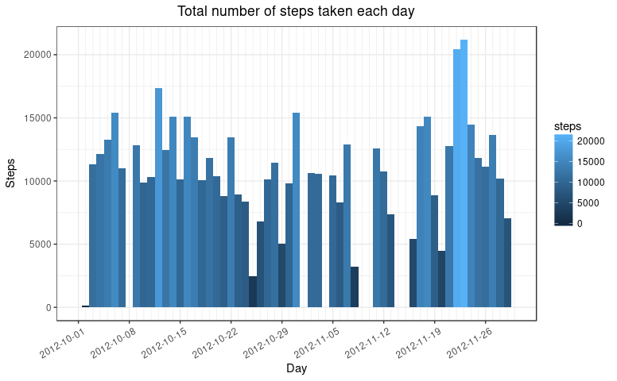
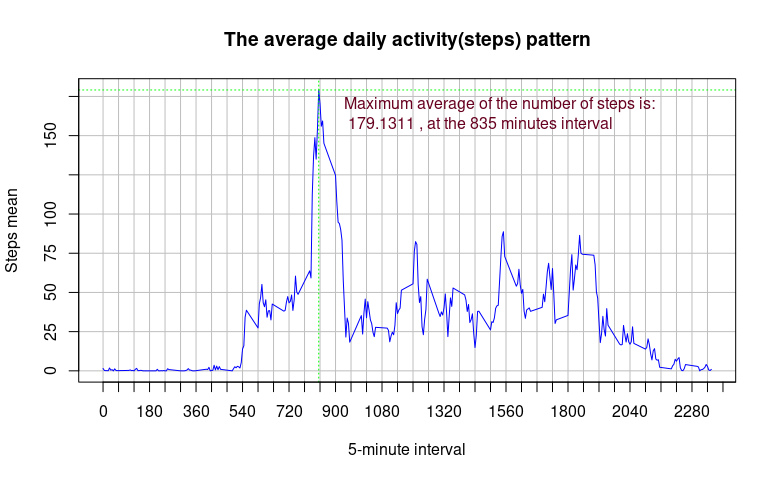
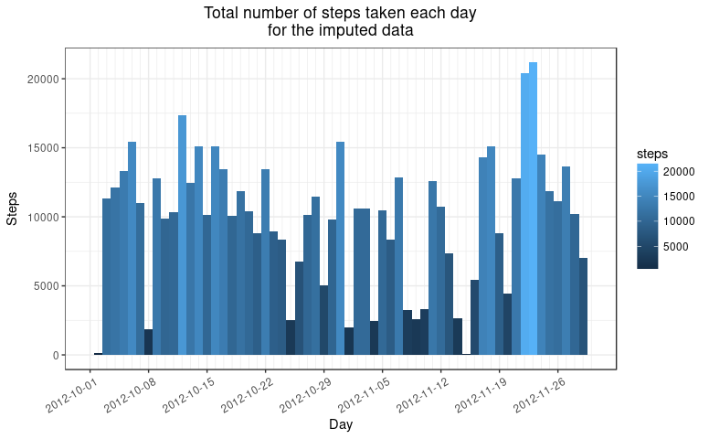
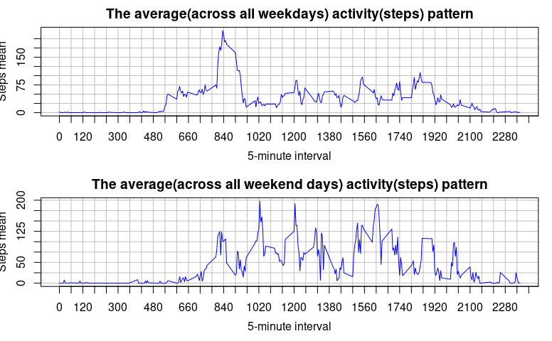

---
##===========================================================================================##
##                                                                                           ##
##  In order to keep "all the code in single R markdown document" we'll do some preparations.##
##                                                                                           ##
##  Technically it is not necessary to split the preparations code into chunks, but we'll do ##
##  that for readability purposes only.                                                      ##
##                                                                                           ##
##===========================================================================================##
---

---
##===========================================================================================##
##                                                                                           ##
##  Declaration of some handy functions and classes.                                         ##
##                                                                                           ##
##===========================================================================================##
---

---
##===========================================================================================##
##                                                                                           ##
##  Load external libraries(knitr included!).                                                ##
##                                                                                           ##
##===========================================================================================##
---

---
##===========================================================================================##
##                                                                                           ##
##  Okay, from here we begin.                                                                ##
##                                                                                           ##
##===========================================================================================##
---

---
Loading and preprocessing the data
---
<h2 style="color:#67001f;">Loading and preprocessing the data</h2>

> Check if the necessary data frame is loaded.

```r
dfDoesExist <- TRUE # Optimistic point of view!

lapply(dfList, function(x) {
    if (dfDoesExist) {
        if (!(exists(x) && is.data.frame(get(x)))) {
            dfDoesExist <<- FALSE
            return()
        }
    }})
```

> If the data frame is not loaded, then we'll search for the CSV file and will create the data frame. If the CVS file is not available, then we'll download the ZIP file for you(into the 'tmpRoughData' directory).

```r
if (FALSE == dfDoesExist) {
    ## There are NOT data frames! Let's build them!.
    
    tmp <- findRoughFile(xList)

    if(is.logical(tmp) && TRUE == tmp) {
        ## Download the zip file.
        
        if(TRUE == doDataDownload()){
            ## Okay, let's try again to find the files!
            tmp <- findRoughFile(xList)
            
            if(!is.logical(tmp) && is.list(tmp)) {
                ## Hooray, we got the files!
            } else {
                ## This is a problem! We haven't rough files!
                stop("This is a problem! We haven't rough files.")
            }
        } else {
            ## This is a problem too! We have to stop!
            stop("Something went wrong trying to download the rough zip file.")
        }
    }
    
    if(!is.list(tmp)) {
        stop("Something weird it's happening here")
    }
    
    ## Let's do the data frames
    
    ##
    ## Load the rough data files into data frames.
    ##
    print("Please be patient; loading the data into the data frames may take a while.")
    
    for (idx in dfList) {
        for (idx1 in tmp) {
            if(xList[idx] == basename(idx1)){
                assign(idx, read.csv(file = idx1, stringsAsFactors = FALSE))
                break
            }
        }
    }
    rm(tmp)
    ##
    ## Recheck for the data frames.
    dfDoesExist1 <- TRUE # Ugly
    lapply(dfList, function(x) {
        if (dfDoesExist1) {
            if (!(exists(x) && is.data.frame(get(x)))) {
                dfDoesExist1 <<- FALSE
                return()
            }
        }})
    
    if (FALSE == dfDoesExist1) {
        stop("The data cannot be loaded into the data frames.")
    }
}
```
---
What is mean total number of steps taken per day?
---
<h2 style="color:#67001f;">What is mean total number of steps taken per day?</h2>


```r
#  1. Calculate the total number of steps taken per day.

res02_01 <- sum(result$steps, na.rm = TRUE)
```
##### The total number of steps taken per day is: <span style="color:#67001f; font-weight:bold">570608</span>


```r
#  2. Make a histogram of the total number of steps taken each day.

## The data set is small, so we can create temporary data frames...
## We'll replace the NA by 0
resultX <- result %>%
           mutate(steps = ifelse(is.na(result$steps), 0, steps),
                  date = as.numeric(as.Date(date, "%Y-%m-%d"))) %>%
           group_by(date) %>%
           summarise(steps = sum(steps))
##
## Generate the plot.
##
ggPlot <- ggplot(resultX, aes(date))

ggPlot <- ggPlot + theme_bw() + scale_colour_brewer(palette = "Set1")

ggPlot <- ggPlot + labs(x = "Day", y = "Steps",
                        title = "Total number of steps taken each day")

ggPlot <- ggPlot + geom_col( aes(x = date, y = steps, fill = steps),
                             position = "stack",
                             width = 1,
                             na.rm = TRUE)

ggPlot <- ggPlot + theme(plot.title = element_text(hjust = 0.5),
                         axis.text.x = element_text(angle = 30, hjust = .9, vjust = .85))

minDate <- min(resultX$date)
maxDate <- max(resultX$date)

ggPlot <- ggPlot + scale_x_continuous(breaks = seq(minDate, maxDate, 7),
                                      minor_breaks = seq(minDate, maxDate, 1),
                                      limits = c(minDate, maxDate),
                                      labels = seq(as.Date(minDate, format = "%Y-%m-%d", origin = "1970-01-01"),
                                                   as.Date(maxDate, format = "%Y-%m-%d", origin = "1970-01-01"),
                                                   "weeks"))

print(ggPlot)
```



```r
#  3. Calculate and report the mean and median of the total number of steps taken per day.

res02_03 <- summary(resultX$steps, na.rm = TRUE)
```
##### For the total number of steps taken per day the mean is: <span style="color:#67001f; font-weight:bold">9354.23</span> and the median is: <span style="color:#67001f; font-weight:bold">10395.00</span>


---
What is the average daily activity pattern?
---
<h2 style="color:#67001f;">What is the average daily activity pattern?</h2>


```r
#  1. Make a time series plot (i.e. type = “l”) of the 5-minute interval (x-axis) and
#     the average number of steps taken, averaged across all days (y-axis).

## As far, we'll replace the NA by 0
resultX <- result %>%
           mutate(steps = ifelse(is.na(result$steps), 0, steps)) %>%
           group_by(interval) %>%
           summarise(steps = mean(steps))

## Get the index of the row containing the maximum average value.
idx <- which(resultX$steps == max(resultX$steps))

plot( resultX$interval, resultX$steps,
      type = "l",
      main = "The average daily activity(steps) pattern",
      xlab = "5-minute interval",
      ylab = "Steps mean",
      panel.first = abline(v = seq(min(resultX$interval), max(resultX$interval), 60),
                           h = seq(0, 200, 25), lty = 1, col = "gray"),
      panel.last = abline(v = resultX$interval[idx], h = resultX$steps[idx],
                          col = "green", lty = 3),
      pch = 19, col = "blue", lwd = 1,
      xaxp = c(min(resultX$interval), 3840, 64),
      yaxp = c(0, 200, 8)
)

#  2. Which 5-minute interval, on average across all the days in the data set,
#     contains the maximum number of steps?

## This is the response text for the second question.
maxText <- paste("Maximum average of the number of steps is:\n", format(resultX$steps[idx], nsmall = 2,
                                                                       scientific = F),
                 ", at the", format(resultX$interval[idx], nsmall = 2, scientific = F),
                 "minutes interval")

text(resultX$interval[idx] + 60, resultX$steps[idx] - 18, maxText, pos = 4, col = "#67001f") 
```




---
Imputing missing values
---
<h2 style="color:#67001f;">Imputing missing values</h2>


```r
#  1. Calculate and report the total number of missing values in the data set
#     (i.e. the total number of rows with NAs)

res04_01 <- nrow(result[rowSums(is.na(result)) > 0,])
```
##### The total number of rows with missing values(NAs) is: <span style="color:#67001f; font-weight:bold">2304</span>


```r
#  2. Devise a strategy for filling in all of the missing values in the data set.
#     The strategy does not need to be sophisticated. For example, you could use
#     the mean/median for that day, or the mean for that 5-minute interval, etc.
```
##### It's probably that the person has a weekly pattern of his behaviour, so the chosen strategy is: <span style="color:#67001f; font-weight:bold">median per week day and per 5-minute interval</span>.


```r
#  3. Create a new data set that is equal to the original data set but with the
#     missing data filled in.

## Group the data by weekday and 5-minute interval.
## Weight the medians.
stepMedianWeight <- .9

resultX <- result %>%
           mutate(wDayAsString = strftime(date, '%A')) %>%
           group_by(wDayAsString, interval) %>%
           summarise(steps =  stepMedianWeight * median(steps, na.rm = TRUE))

## In order to keep the code a little bit more readable, we'll define the function called "getRoundMedian".
## For each (weekday, interval) the function return the correspondent rounded steps median.

getRoundMedian <- function(x, y, df = resultX){
    return(round(df$steps[which(df$wDayAsString == strftime(x, '%A') & df$interval == y)]))
}

## Fill in the NAs with rounded and weighted medians, using the "resultX medians" data frame.
resultImputed <- result %>%
                 rowwise() %>%
                 mutate(steps = ifelse(is.na(steps), getRoundMedian(date, interval), steps))
```
##### The new imputed data frame is: <span style="color:#67001f; font-weight:bold">resultImputed</span>.
> The original data frame have <span style="color:#67001f;">17568</span> rows.<br />The imputed data frame have <span style="color:#67001f;">17568</span> rows.<br />The original data frame have <span style="color:#67001f;">2304</span> NAs.<br />The imputed data frame have <span style="color:#67001f;">0</span> NAs.


```r
#  4. Make a histogram of the total number of steps taken each day and calculate
#     and report the mean and median total number of steps taken per day.
#     Do these values differ from the estimates from the first part of the assignment?
#     What is the impact of imputing missing data on the estimates of the total daily
#     number of steps?

## Prepare the imputed data for plotting.
resultX <- resultImputed %>%
           mutate(date = as.numeric(as.Date(date, "%Y-%m-%d"))) %>%
           group_by(date) %>%
           summarise(steps = sum(steps))

##
## Generate the plot for the imputed data.
##
ggPlot <- ggplot(resultX, aes(date))

ggPlot <- ggPlot + theme_bw() + scale_colour_brewer(palette = "Set1")

ggPlot <- ggPlot + labs(x = "Day", y = "Steps",
                        title = "Total number of steps taken each day\nfor the imputed data")

ggPlot <- ggPlot + geom_col( aes(x = date, y = steps, fill = steps),
                             position = "stack",
                             width = 1,
                             na.rm = TRUE)

ggPlot <- ggPlot + theme(plot.title = element_text(hjust = 0.5),
                         axis.text.x = element_text(angle = 30, hjust = .9, vjust = .85))

minDate <- min(resultX$date)
maxDate <- max(resultX$date)

ggPlot <- ggPlot + scale_x_continuous(breaks = seq(minDate, maxDate, 7),
                                      minor_breaks = seq(minDate, maxDate, 1),
                                      limits = c(minDate, maxDate),
                                      labels = seq(as.Date(minDate, format = "%Y-%m-%d", origin = "1970-01-01"),
                                                   as.Date(maxDate, format = "%Y-%m-%d", origin = "1970-01-01"),
                                                   "weeks"))

print(ggPlot)
```



```r
res04_04 <- summary(resultX$steps, na.rm = TRUE)

res04_05 <- sum(resultImputed$steps, na.rm = TRUE)
```
##### As we expected, the new histogram has less "holes"(the zero height bars for NAs).
##### For the imputed data, the total number of steps taken per day the mean is: <span style="color:#67001f; font-weight:bold">9670.197</span> and the median is: <span style="color:#67001f; font-weight:bold">10395.00</span>

> 1. We notice that the new mean is greater(<span style="color:#67001f;">9670.197 vs. 9354.23</span>), but<br /> the median is the same(<span style="color:#67001f;">10395.00 vs. 10395.00</span>)
> 2. The total daily number of steps have increased too(<span style="color:#67001f;">589882</span> vs. <span style="color:#67001f;">570608</span>). This is normal, in fact we added "some steps".


---
Are there differences in activity patterns between weekdays and weekends?
---
<h2 style="color:#67001f;">Are there differences in activity patterns between weekdays and weekends?</h2>


```r
#  1. Create a new factor variable in the data set with two levels – “weekday” and
#     “weekend” indicating whether a given date is a weekday or weekend day.

## Add the new factor variable "dayType" to the original data frame.
result$dayType <- factor(ifelse(strftime(result$date, '%u') == 7, "weekend", "weekday"))
```

```r
#  2.Make a panel plot containing a time series plot (i.e. type = “l”) of the 5-minute
#    interval (x-axis) and the average number of steps taken, averaged across all
#    weekday days or weekend days (y-axis). See the README file in the GitHub repository
#    to see an example of what this plot should look like using simulated data.

## Save the current par() configuration in order to be able to restore it after this plot.
currentPar <- par(no.readonly = TRUE)

par(mar = c(4, 3, 2, 1), mfrow = c(2, 1))

## Prepare the data for the first plot.
resultX <- result %>%
           filter(dayType == "weekday") %>%
           group_by(interval) %>%
           summarise(steps = mean(steps, na.rm = TRUE))

## Make the first plot.
plot( resultX$interval, resultX$steps,
      type = "l",
      main = "The average(across all weekdays) activity(steps) pattern",
      xlab = "5-minute interval",
      ylab = "Steps mean",
      panel.first = abline(v = seq(min(resultX$interval), max(resultX$interval), 60),
                           h = seq(0, 200, 25), lty = 1, col = "gray"),
      pch = 19, col = "blue", lwd = 1,
      xaxp = c(min(resultX$interval), 3840, 64),
      yaxp = c(0, 200, 8),
      mgp = c(2.4, 1, 0)
)

## Prepare the data for the second plot.
resultX <- result %>%
           filter(dayType == "weekend") %>%
           group_by(interval) %>%
           summarise(steps = mean(steps, na.rm = TRUE))

## Make the second plot.
plot( resultX$interval, resultX$steps,
      type = "l",
      main = "The average(across all weekend days) activity(steps) pattern",
      xlab = "5-minute interval",
      ylab = "Steps mean",
      panel.first = abline(v = seq(min(resultX$interval), max(resultX$interval), 60),
                           h = seq(0, 200, 25), lty = 1, col = "gray"),
      pch = 19, col = "blue", lwd = 1,
      xaxp = c(min(resultX$interval), 3840, 64),
      yaxp = c(0, 200, 8),
      mgp = c(2.4, 1, 0)
)
```



```r
## Restore the previous saved par() configuration.
par(currentPar)
```


